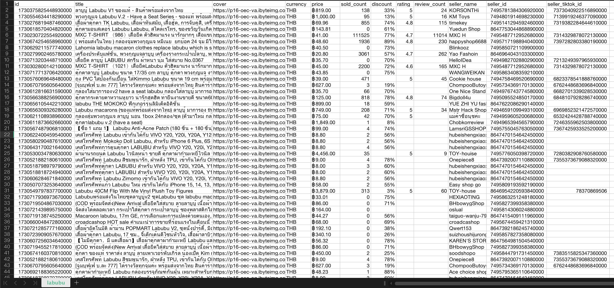

# Tiktok Shop API Python (Unofficial)

<p align="center">
  
</p>

[](https://github.com/Lundehund/tiktok-shop-api/stargazers/)
[](https://github.com/Lundehund/tiktok-shop-api/network/)
[](https://twitter.com)
[](https://github.com/Lundehund/tiktok-shop-api)
[](https://mit-license.org/)

## Getting Started

Import the `TiktokShopApi` class and add your RapidAPI Key. You can get the key at [RapidAPI Tiktok Shop](https://rapidapi.com/Lundehund/api/tiktok-shop-api).

```python
from TiktokShopApi import TiktokShopApi

x_rapidapi_key = 'YOUR_X_RAPIDAPI_KEY'
client = TiktokShopApi(x_rapidapi_key)
```


## Methods
- get_seller_products(user_id, region, count, cursor)
- get_product_detail(product_id, region)
- get_product_reviews(product_id, region, count, cursor, sort_type)
- search_products(keyword, region, count, cursor)

## Examples

The file `/example.py` is an example of searching for products (with keyword `labubu` and region `TH`) on TikTok Shop and saving valuable data to a CSV file.

You can view this file in `labubu.csv` or try with your own keyword.



Alternatively, you can go to the `/examples` folder to view the raw results in JSON format.
